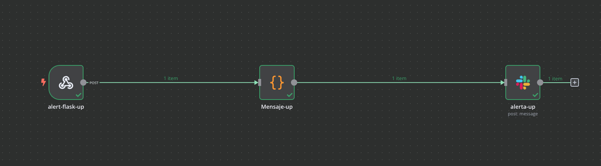

<h1 align="center">Sistema Automatizado de Monitoreo de Infraestructuras: "S.A.M.I."</h1>

## SAMI:

"S.A.M.I. es un **Sistema Automatizado de Monitoreo de Infraestructuras** diseñado para recopilar y analizar métricas en los componentes de una infraestructura informática. Su objetivo principal es mantener y optimizar el rendimiento y la operatividad del sistema.
Este sistema realiza la extracción de métricas tanto del hardware, que abarca el uso de la CPU y memoria interna, como del software, a través de la interpretación de instrucciones del sistema operativo y las actividades de los usuarios."  

   
  Componetes del proyecto SAMI
  
 

## Características:

En este proyecto se monitorean las métricas de rendimiento del uso de CPU y memoria RAM de un contenedor Docker que ejecuta el framework Flask. Se aprovecha la extracción de métricas realizada a este contenedor por el servicio cAdvisor. Este servicio proporcionará periódicamente estas métricas a solicitud de Prometheus para su gestión. Por otro lado, se monitorean también las métricas de solicitudes HTTP a un endpoint implementado en el framework Flask, el cual expone una API escrita en Python. Estas métricas son monitoreadas mediante la librería Prometheus Client. El objetivo de este monitoreo es el siguiente

1. **Diseñar reportes**: Alimentar un flujo de trabajo creado en n8n para diseñar un informe periódico que será solicitado desde n8n a Prometheus. Luego, desde n8n, se enviará el informe a través de correo electrónico con información sobre el uso máximo y mínimo de memoria y CPU.  

<strong> Resultado sobre el workflow de envio de reporte</strong>  
    
  Workflow n8n en la creación y envío de reporte periódico, con valores máximos y mínimos de uso de memoria y CPU usando el servicio Gmail
  
 

   
  Contenido de email con reporte de métricas "usos máximo y mínimo de CPU y RAM" 
  
 

2. **Atender dos alertas**: Atender dos alertas, una relacionada con el estado en ejecución del servidor Flask y otra con la tasa promedio de solicitudes a la API expuesta por Flask. Estas alertas serán enviadas desde Alertmanager hacia n8n quien, al recibirlas, reenviará un mensaje a través de Slack con información detallada de la alerta recibida.   

  

  <strong> - Resultado sobre el workflow de estado en ejecución del servidor</strong>  
      
    Workflow n8n para el envio de alerta por "servidor apagado", usando el servicio Slack
  
 

   
  Contenido de mensaje slack por alerta "servidor apagado"
  
 

  

  <strong> - Resultado sobre el workflow de estado en ejecución del servidor</strong>  
   
  Workflow n8n para el envio de alerta por "sobrecarga de solicitudes http a endpoint", usando el servicio Slack
  
 

  

   
  Contenido de mensaje slack por alerta de "aumento de tasa de solicitudes http" a endpoint monitoreado
  
 

## Tecnologías Utilizadas

- **Prometheus**: Es un sistema que se encarga de extraer, almacenar y realizar operaciones sobre las métricas recopiladas de los componentes en la infraestructura.

- **AlertManager**: Es un módulo integrado en Prometheus que se encarga de gestionar el ciclo de vida de las alertas.

- **Prometheus Client**: es una librería de Prometheus que interactúa con aplicaciones escritas en Python para exponer métricas internas de las funcionalidades de dicha aplicación.

- **Cadvisor**: Es un módulo integrado en Prometheus que se encarga de extraer estadísticas de los contenedores y entregárselas a Prometheus.

- **Flask**: Es un framework ligero, rápido y eficiente que se utilizará para desarrollar una aplicación en Python, la cual servirá recursos a través de un endpoint que posteriormente proporcionará métricas al módulo de Prometheus.

- **n8n**: Es una herramienta de software que permite automatizar tareas rutinarias mediante la creación de flujos de trabajo o workflows. Como parte de la infraestructura, facilitará el envío de mensajes de alerta y reportes al equipo técnico responsable del buen funcionamiento de la infraestructura."

- **Docker Compose**: es un sistema de virtualización a nivel de sistema operativo que permite ejecutar múltiples programas o servicios dentro de contenedores descritos en un solo archivo. Como parte de la infraestructura, Docker Compose permite virtualizar todo el software de trabajo necesario para el buen funcionamiento de la infraestructura.
